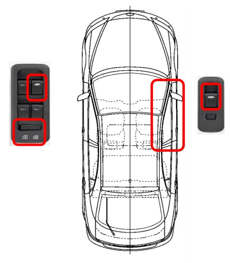

# Car Window Control System

## Overview

This repository contains the implementation of a car window control system using FreeRTOS. The system supports both manual and automatic control of the front passenger door window, with control panels accessible by both the driver and the passenger. Key features include limit switch integration, obstacle detection, and a window lock function.

## System Features

1. **Manual Open/Close Function**:
   - When the power window switch is pushed or pulled continuously, the window opens or closes until the switch is released.
2. **One Touch Auto Open/Close Function**:
   - When the power window switch is pushed or pulled shortly, the window fully opens or closes.
3. **Window Lock Function**:
   - When the window lock switch is turned on, the opening and closing of all windows except the driver’s window is disabled.
4. **Jam Protection Function**:
   - This function automatically stops the power window and moves it downward about 0.5 second if foreign matter gets caught in the window during one touch auto close operation.

	

## System Components

### Hardware
- Nucleo-64 STM32 Development Board
- Motor and Motor Driver
- Limit Switches
- Push Buttons for control
- GPIO Pins for interfacing

### Software
- FreeRTOS
- STM32 HAL Library

## Code Structure

### Task Functions
- **Button Handling Tasks**:
  - `Button_Task`: Manages button presses and creates corresponding tasks for window movement.
- **Driver Tasks**:
  - `Driver_Up_Auto`, `Driver_Up_Manual`, `Driver_Down_Auto`, `Driver_Down_Manual`: Handle driver control for window movement.
- **Passenger Tasks**:
  - `Passenger_Up_Auto`, `Passenger_Up_Manual`, `Passenger_Down_Auto`, `Passenger_Down_Manual`: Handle passenger control for window movement.
- **State Management Tasks**:
  - `Set_Upper_Limit`, `Set_Lower_Limit`, `Set_Window_Lock`, `Set_Jam_Detected`: Manage system states using semaphores.

### Utility Functions
- **Motor Control**:
  - `Motor_Move_Forward`, `Motor_Move_Backward`, `Motor_Stop`: Control window motor movement.
- **Movement Handling**:
  - `Handle_Window_Movement`, `Handle_Manual_Movement`: Manage the movement logic based on control input and system state.

## Getting Started

### Prerequisites
- STM32CubeIDE
- STM32 HAL Library
- FreeRTOS

### Installation
1. Clone the repository:
   ```sh
   git clone https://github.com/yourusername/car-window-control.git
   ```
2. Open the project in STM32CubeIDE.
3. Ensure FreeRTOS and STM32 HAL libraries are included in the project.
4. Build the project and flash it to your Nucleo-64 STM32 development board.